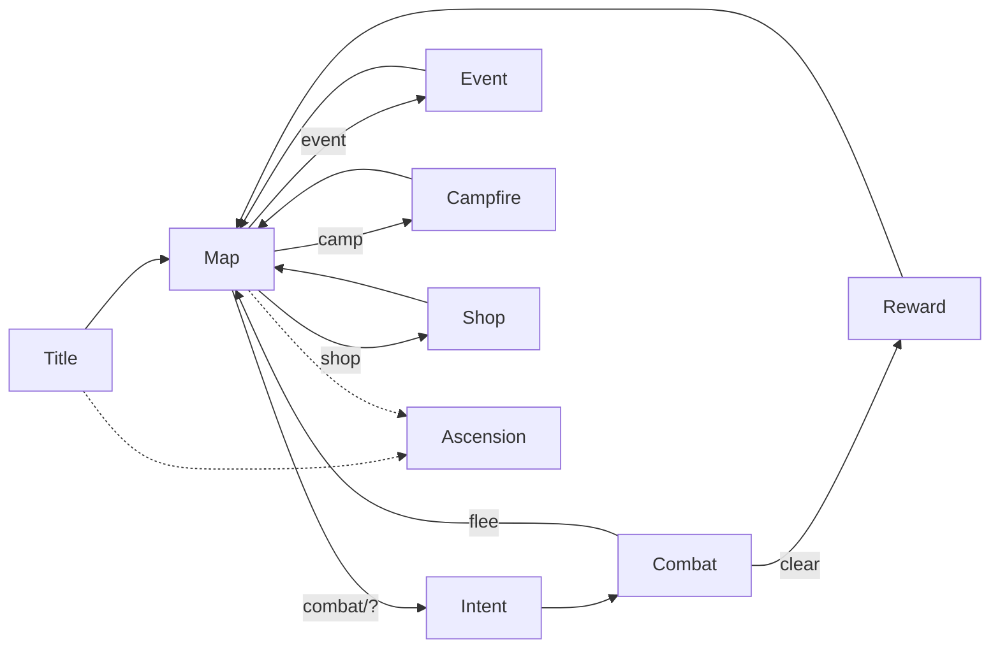

# Spire UI kit — formats, styling, wireframes

Same idea as harrisonhalperin.com/work: **shared chrome, distinct format per surface.**
Map is not Campfire. Reward is not Shop. Each facet gets its own layout contract,
type hierarchy, motion budget, and do/don't list — then a wireframe that encodes it.

| Doc | Purpose |
| --- | --- |
| [DESIGN_SYSTEM.md](DESIGN_SYSTEM.md) | Tokens, type, class colors, motion, accessibility |
| [formats/](formats/) | Per-facet layout + copy + interaction rules |
| [wireframes/](wireframes/index.html) | Browsable low-fi HTML wireframes |
| [templates/facet-format.md](templates/facet-format.md) | Blank template when adding a new facet |

## Facets (v0)

| Facet | Format | Wireframe |
| --- | --- | --- |
| Title / Continue | [formats/title.md](formats/title.md) | [wireframes/title.html](wireframes/title.html) |
| Map | [formats/map.md](formats/map.md) | [wireframes/map.html](wireframes/map.html) |
| Intent | [formats/intent.md](formats/intent.md) | [wireframes/intent.html](wireframes/intent.html) |
| Combat | [formats/combat.md](formats/combat.md) | [wireframes/combat.html](wireframes/combat.html) |
| Event | [formats/event.md](formats/event.md) | [wireframes/event.html](wireframes/event.html) |
| Reward | [formats/reward.md](formats/reward.md) | [wireframes/reward.html](wireframes/reward.html) |
| Campfire | [formats/campfire.md](formats/campfire.md) | [wireframes/campfire.html](wireframes/campfire.html) |
| Shop | [formats/shop.md](formats/shop.md) | [wireframes/shop.html](wireframes/shop.html) |
| Ascension | [formats/ascension.md](formats/ascension.md) | [wireframes/ascension.html](wireframes/ascension.html) |
| Active-room chrome | [formats/chrome.md](formats/chrome.md) | (banner on all in-run wireframes) |

## How to use while building

1. Implementing a screen → open its **format** first; treat layout regions as API.  
2. Changing layout → update format + wireframe in the same PR.  
3. New facet → copy `templates/facet-format.md`, add wireframe, link here.  
4. Open `wireframes/index.html` in a browser (no build step).

## Principle

**Entertainment pays for single-task focus.** Every format must make the *one current room* feel like the only interesting thing on screen.

## Screen flow

Open the [wireframe gallery](wireframes/index.html) while implementing.
